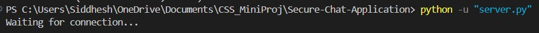
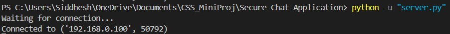
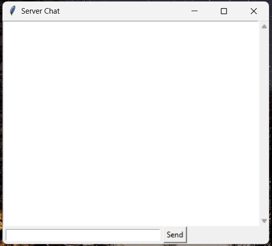
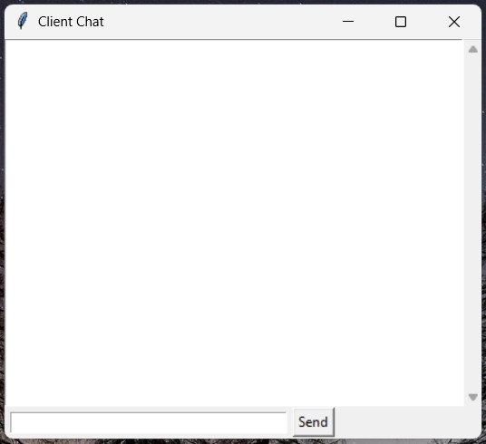
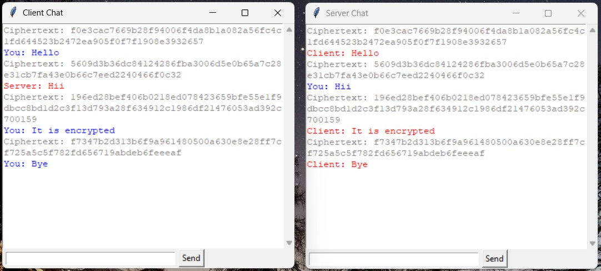

# Secure Chat Application (AES-GCM)

## Features
- GUI-based Chat Application
- AES-GCM Encryption
- Real-time communication using sockets
- Multithreading (send & receive)

## How to Run
1. Install dependencies:
   pip install -r requirements.txt

2. Run server:
   python server.py

3. Run client:
   python client.py

## Demo Video
https://drive.google.com/file/d/16ZT9HWHzjGhs4NZIQrV86GiCYc9tUPsk/view?usp=drive_link

## Screenshots

## Server

## Client

### Server GUI

### Client GUI

### Chat in Action

